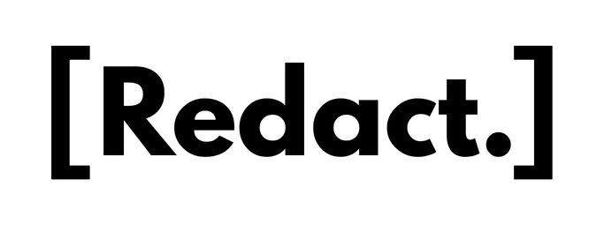

<p align="center">
  
</p>

<h1 align="center">[Redact.]</h1>

<p align="center">
  <strong>Automated, Confidential & Hardware-Accelerated File Redaction Engine</strong><br>
  <em>Permanently mask sensitive data across images, documents, and videos with zero permanent data retention.</em>
</p>

<p align="center">
  
  
  
  
  
  
</p>

---

## 🌟 Overview

**[Redact.]** is a modern, security-first automated redaction application designed for organizations and individuals handling sensitive media. Powered by hardware-accelerated **RapidOCR**, it automatically discovers confidential entities—such as banking details, passwords, government IDs, phone numbers, and custom keywords—and permanently masks them with solid pixel-level black redaction blocks.

Unlike traditional tools that apply reversible blurs or leave hidden metadata/text layers in documents, **[Redact.]** raster-flattens media and strictly enforces a **Zero Data Retention** lifecycle.

---

## ✨ Key Features

- 🖼️ **Multi-Format Support**:
  - **Images**: `PNG`, `JPG`, `JPEG` (high-fidelity bounding-box masking)
  - **Documents**: `PDF` (multi-page processing, flattened to eliminate selectable text layers)
  - **Videos**: `MP4`, `MOV` (frame-by-frame OCR tracking with automatic chunking for smooth processing)
- 🔒 **Zero Data Retention**: Uploaded source files are cryptographically isolated in temporary memory/disk locations and immediately destroyed upon redaction.
- ⬛ **True Irreversible Redaction**: Replaces raw pixel arrays with solid black `(0, 0, 0)` blocks. No translucent masks, blur filters, or pixelation that can be reverse-engineered.
- 🎯 **Intelligent Detection Rules**: Out-of-the-box regex heuristics for currency amounts, bank accounts/IBAN, passwords, OTPs, PINs, CVVs, national IDs (SSN, PAN), and numeric sequences.
- ✍️ **Custom Redaction Prompts**: Specify custom keywords, phrases, or names on-the-fly to redact bespoke identifiers.
- ⚡ **RapidOCR Acceleration**: Lightweight, high-accuracy neural OCR engine preloaded for sub-second image processing.
- 🎨 **Sleek, Modern Web UI**: Built with a focused dark-mode aesthetic, drag-and-drop workspace, live security scanning visualization, and instant side-by-side preview.

---

## 🛡️ Security & Confidentiality Architecture

| Principle | Implementation Details |
| :--- | :--- |
| **Zero Permanent Storage** | Source files are purged immediately from disk upon generating the redacted output. |
| **Flattened PDF Security** | PDFs are rasterized into high-resolution bitmap layers during redaction, eliminating underlying hidden text layers and embedded fonts. |
| **Zero Log Leakage** | OCR extraction values, extracted tokens, and confidential strings are strictly omitted from server logs. |
| **Cryptographic Isolation** | Every upload and processing task runs in a distinct UUID-isolated temporary directory with strictly constrained path sanitization. |
| **Expiring Token Downloads** | Redacted assets are accessible only via single-use / time-limited cryptographically secure tokens. |

---

## 🏗️ Project Structure

```text
Redact/
├── backend/
│   ├── app.py                     # Flask API server & static asset host
│   ├── config.py                  # Environment limits, paths & CORS policies
│   ├── redaction/
│   │   ├── __init__.py            # Unified redact_file() pipeline router
│   │   ├── detector.py            # RapidOCR singleton & detection engine
│   │   ├── rules.py               # Regular expressions & sensitive data rules
│   │   ├── utils.py               # Bounding-box geometry, IoU & dedup helpers
│   │   ├── image_redactor.py      # Image processing pipeline (OpenCV / PIL)
│   │   ├── pdf_redactor.py        # Raster-flattened PDF pipeline (PyMuPDF)
│   │   └── video_redactor.py      # Video frame tracking & chunking pipeline
│   └── requirements.txt           # Python dependencies
├── frontend/
│   ├── assets/
│   │   ├── logo.png               # Brand logo
│   │   └── favicon.png            # Application favicon
│   ├── css/
│   │   └── style.css              # Technical dark-mode design system
│   ├── js/
│   │   ├── app.js                 # Frontend state machine & UI controller
│   │   ├── upload.js              # File drag-and-drop & format validation
│   │   ├── preview.js             # Media renderer & download manager
│   │   └── animation.js           # Security scanning animation engine
│   └── index.html                 # Main web application entry point
├── .env.example                   # Example environment configuration
└── README.md                      # Project documentation
```

---

## 🚀 Getting Started

### Prerequisites

- **Python 3.9+** (Python 3.10 or 3.11 recommended)
- **pip** package manager

### 1. Clone & Setup Repository

```bash
git clone https://github.com/YOUR_USERNAME/Redact.git
cd Redact
```

### 2. Create and Activate a Virtual Environment

```bash
# macOS / Linux
python3 -m venv venv
source venv/bin/activate

# Windows
python -m venv venv
venv\Scripts\activate
```

### 3. Install Dependencies

```bash
pip install -r backend/requirements.txt
```

### 4. Configure Environment (Optional)

Copy `.env.example` to create your local `.env` configuration:

```bash
cp .env.example .env
```

| Variable | Default | Description |
| :--- | :--- | :--- |
| `FLASK_PORT` | `5003` | Port for the local Flask server |
| `FLASK_DEBUG` | `false` | Enable/disable Flask debug mode |
| `UPLOAD_MAX_SIZE_MB` | `100` | Maximum file upload size limit (MB) |
| `VIDEO_MAX_DURATION_SECONDS`| `10.0` | Threshold duration for video chunk processing |
| `REDACTPRO_TEMP_DIR` | *(auto)* | Optional custom temporary storage directory |

---

## 🖥️ Running the Application

Start the integrated backend server:

```bash
python3 backend/app.py
```

Once started, open your browser and navigate to:
```
http://localhost:5003
```

---

## ⚙️ Configuration & Detection Rules

### Built-in Detection Rules
Regex patterns for automatic entity recognition are defined in [`backend/redaction/rules.py`](file:///Users/som/MyProjects/Redact/backend/redaction/rules.py):
- **Currency**: `₹`, `$`, `€`, `£`, `¥` formatted amounts
- **Account Numbers & Financial IDs**: Bank account numbers, IBAN, IFSC
- **Credentials**: Passwords, PINs, OTP codes, CVVs
- **Identity Numbers**: SSN, PAN, Tax IDs, Employee/Customer IDs
- **Contact Info**: Standard email addresses and international phone numbers
- **Numerical Sequences**: Arbitrary sequences of 4+ digits

### OCR Engine Tuning
Customize detection behavior via `DetectionConfig` in [`backend/redaction/detector.py`](file:///Users/som/MyProjects/Redact/backend/redaction/detector.py):
- `ocr_scale`: Scaling factor applied to images prior to OCR (default: `0.75`).
- `min_confidence`: Minimum confidence score to register detected text (default: `0.35`).
- `padding_x`, `padding_y`: Safety margin pixels around detected bounding boxes to guarantee complete coverage.

---

## 🔌 API Endpoints

| Method | Endpoint | Description |
| :--- | :--- | :--- |
| `POST` | `/api/redact` | Upload media file + optional custom instructions for redaction. |
| `GET` | `/api/download/<token>` | Download redacted output using a secure token. |
| `GET` | `/api/preview/<token>` | Stream/preview redacted media in the browser. |
| `GET` | `/api/health` | Healthcheck and OCR engine readiness status. |

---

## 📄 License

This project is open source and available under the [MIT License](LICENSE).
